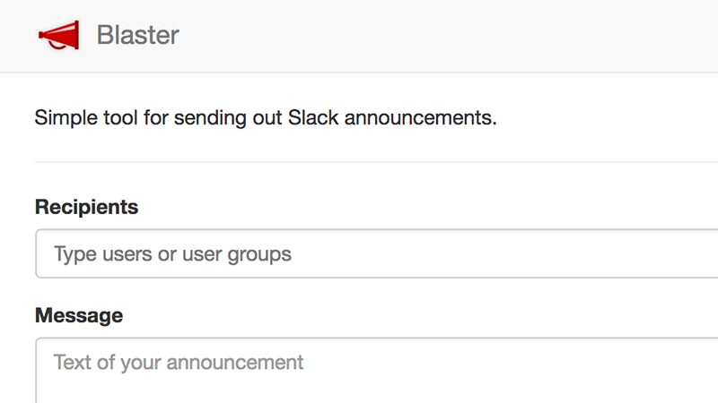

# Blaster

Simple tool for sending out Slack announcements to multiple users without creating a private channel (similar to blind carbon copy).

Open-source web application written in Go and hosted on Heroku. Relies on the Slack API for all communication and persistence, 
but wraps it into a simple API of its own for optimisation.

## Links

* _[Open app](https://blaster.gouline.net)_
* [GitHub project](https://github.com/gouline/blaster)
* [Slack app](https://slack.com/oauth/authorize?client_id=82086680103.380961177015&scope=users:read,team:read,im:write,chat:write:user,chat:write:bot,usergroups:read)
