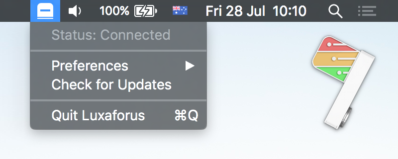

# Luxaforus

Minimalist [Luxafor](https://luxafor.com/) client application for macOS.

## How it works

There are no explicit controls for the light, instead the light turns red when the 'Do Not Disturb' mode is enabled in the macOS Notification Center and green when it's disabled. When your computer goes to sleep mode or the application is quitting, the light will be turned off.

Luxaforus is also integrated with the Slack API to synchronise your 'Do Not Disturb' status with your Slack account.

## Links

* **[Download](https://github.com/gouline/luxaforus/releases/latest)**
* [GitHub](https://github.com/gouline/luxaforus)
* [Slack app](https://slack.com/apps/A6D4Y8341-luxaforus)
* [Privacy policy](/luxaforus/privacy)
